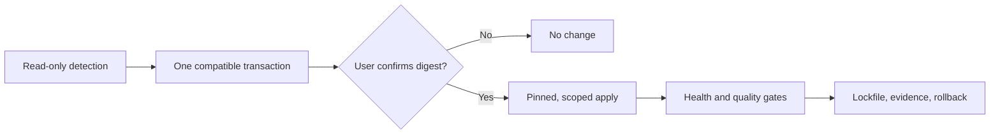

# Codex AI Game Studio


[](https://github.com/frabcd/codex-ai-game-studio/actions/workflows/ci.yml)
[](plugins/ai-game-studio/catalog/catalog.json)
[](plugins)
[](#choose-your-edition)
[](LICENSE)
[](https://github.com/frabcd/codex-ai-game-studio/releases)

An installable, safety-first game-production system for Codex: **85 core
skills, 95 bundled skills, 49 studio roles, 163 verified repositories, five
editor MCP packs, and dedicated Windows and macOS editions**. It plans games,
finds compatible AI tools, reconstructs reference images as quality-gated
procedural Three.js models, generates and validates assets, automates supported
engines, and keeps every setup reversible.

## Install

```text
Codex, install Codex AI Game Studio from
https://github.com/frabcd/codex-ai-game-studio.
Add its marketplace, install the core plugin, inspect this project's OS,
engine, DCC tools, GPU, and existing MCP servers. On Windows or macOS, propose
exactly the matching edition; on Linux, keep the universal core. Include the
img2threejs plugin when this project needs image-to-procedural-3D work. Propose
one compatible setup with licenses, downloads, permissions, and rollback
steps, and wait for my confirmation before changing anything.
```

```text
codex plugin marketplace add frabcd/codex-ai-game-studio --ref main
codex plugin add ai-game-studio@frabcd-ai-game-studio
```

[Install the core plugin in Codex](codex://plugins/install/ai-game-studio?marketplace=frabcd-ai-game-studio)

Start a **new task** after installation. Type `/` and select an enabled skill, or invoke the router explicitly:

```text
$ai-game-studio:start Help me turn this folder into a playable vertical slice.
```

The core plugin is self-contained and universal-directory-ready. Engine, DCC, pixel-art, and lifecycle-automation packs stay optional in this GitHub marketplace because they can execute local processes or control desktop applications.

## Choose your edition

The repository ships two curated Codex distributions. Both include the
universal core, automation and editor packs, and the Apache-2.0 img2threejs
workflow; each includes exactly one matching platform planner.

### Windows

```text
codex plugin add ai-game-studio-windows@frabcd-ai-game-studio
codex plugin add ai-game-studio-img2threejs@frabcd-ai-game-studio
```

```text
$ai-game-studio-windows:setup-windows-edition Inspect this machine read-only.
Prefer native Windows tools. If a useful workflow is macOS, POSIX, Homebrew,
Apple-Silicon, or Metal bound, adapt licensed portable source when testable;
otherwise compare verified Windows equivalents. Never claim binary
compatibility, and wait for my transaction digest before changing anything.
```

[Download the Windows v1.1.1 edition](https://github.com/frabcd/codex-ai-game-studio/releases/download/v1.1.1/codex-ai-game-studio-windows-v1.1.1.zip)
· [Windows tutorials](docs/platforms/windows.md)

### macOS

```text
codex plugin add ai-game-studio-macos@frabcd-ai-game-studio
codex plugin add ai-game-studio-img2threejs@frabcd-ai-game-studio
```

```text
$ai-game-studio-macos:setup-macos-edition Inspect this Mac read-only. Prefer
native Apple Silicon or Intel tools and Metal, MPS, Core ML, or CPU routes. If
a useful workflow is Windows, PowerShell, CUDA, or DirectML bound, adapt
licensed portable source when testable; otherwise compare verified macOS
equivalents. Disclose Rosetta and hosted fallbacks, and wait for my transaction
digest before changing anything.
```

[Download the macOS v1.1.1 edition](https://github.com/frabcd/codex-ai-game-studio/releases/download/v1.1.1/codex-ai-game-studio-macos-v1.1.1.zip)
· [macOS tutorials](docs/platforms/macos.md)

Use `v1.1.1` or later for marketplace-installed platform plugins. Version
`v1.1.0` remains published for provenance but cannot hand an independently
cached platform descriptor to the core.

The edition ZIPs are convenience marketplaces, not preinstalled engines or
models. A platform selection writes only transaction-listed project state; any
package, application, MCP, model, Rosetta, WSL, or hosted-service change needs a
separate confirmed proposal.

## The 60-second quickstart

1. Install the core with the two commands above. On Windows or macOS, add
   exactly one matching platform edition; on Linux, use the core directly.
   Start a new task.
2. Type `/` and choose **AI Game Studio: Start**, or write
   `$ai-game-studio:start`.
3. Describe the outcome—not the tooling. For example: `Make a two-minute Godot arena prototype from this concept art.`
4. Codex inspects the project and machine **read-only**, searches the offline catalog, and returns one setup/workflow proposal.
5. Review its exact pins, downloads, licenses, permissions, backups, and rollback. Confirm the displayed digest only if it is right.
6. Codex applies exactly that transaction, validates the result, and records choices under `.ai-game-studio/`.

No catalog entry is automatically cloned, no model weights are silently downloaded, and no existing source asset is replaced without human approval.

## Four ways to invoke it

| Surface | Use | Meaning |
|---|---|---|
| Codex CLI `/plugins` | Install, enable, update, or inspect plugins | Plugin management, not a game workflow |
| Codex CLI `/` | Browse enabled skills | Pick a workflow interactively |
| Codex CLI/Desktop `$ai-game-studio:skill` | Invoke one skill exactly | Stable, explicit workflow invocation |
| ChatGPT Work `@` | Select an installed plugin or skill | Graphical plugin selection |

Deprecated custom-prompt aliases are intentionally absent. In IDE integrations that do not expose plugins, install or copy the standalone `skills/` directories as a fallback; live hooks and plugin-bundled MCP packs require a plugin-capable Codex surface.

See the official [Codex plugin guide](https://learn.chatgpt.com/docs/plugins) and [slash-command reference](https://learn.chatgpt.com/docs/reference/slash-commands) for the current product behavior.

## What makes this a game studio

- **Full production workflow:** concept, GDD, architecture, backlog, prototype, vertical slice, content, QA, launch, live operations, and retrospectives.
- **Generative asset pipelines:** 2D sprites and tiles, image/text-to-3D, PBR materials, rigs, animation, worlds, dialogue, voices, music, and sound effects.
- **Reference-to-code 3D:** the pinned img2threejs forge turns suitable object
  or character references into procedural Three.js with strict spec,
  multi-angle, material, structure, and bounded-correction gates.
- **Native platform editions:** Windows and macOS planners detect the real host
  and convert incompatible workflows through tested source adaptations or
  disclosed capability equivalents.
- **Tool routing:** 163 curated GitHub repositories classified by capability, platform, runtime, GPU, licenses, permissions, risk, and maturity—usable offline.
- **Editor automation:** opt-in packs for Unity, Godot, Unreal, Blender, and pixel-art workflows, with one MCP server allowed per host application.
- **Quality evidence:** technical checks, multi-view visual review, temporal consistency, performance budgets, playability smoke tests, provenance, and before/after artifacts.
- **Codex-native parity:** 73 attributed workflows, 49 agent TOMLs, 12 mapped hook behaviors, 11 scoped rules, and 40 actual upstream templates from the pinned Claude Code Game Studios baseline, plus 12 new generative-game skills.

This project complements [OpenAI's browser-focused Game Studio plugin](https://github.com/openai/plugins/tree/main/plugins/game-studio). Its emphasis is cross-engine generative tooling, local editor routing, provenance, reversible automation, and production quality gates.

## Safety model: inspect → propose → confirm → apply → verify



Every mutating pack or platform command starts from `pack plan` or
`edition plan`. A transaction records `plan_id`, the detected environment,
exact actions, downloads, license findings, permissions, backups, rollback
operations, expiry, and a canonical digest. `pack apply` and `edition apply`
refuse missing, expired, altered, or unconfirmed digests.

Read-only inspection may identify executables, versions, project markers, MCP server names, GPU backends, VRAM, free disk, and whether required credential **environment-variable names** exist. It never reads or prints secret values.

## “What should I say?”

Use plain outcomes. The router will select the specialist workflow.

| Goal | Prompt to paste |
|---|---|
| Adopt an existing game | `$ai-game-studio:start Inspect this existing project, preserve its conventions, identify the riskiest production gap, and propose a reversible first milestone.` |
| Start a new game | `$ai-game-studio:prompt-to-game Turn this idea into a scoped playable prototype: [idea]. Ask only decisions that materially change the result.` |
| Unity | `$ai-game-studio:engine-automation Detect this Unity version and existing MCPs. Propose one compatible Unity adapter and a smoke test; do not install or edit until I confirm.` |
| Godot | `$ai-game-studio:engine-automation Prepare this Godot project for a two-minute vertical slice. Prefer native GDScript unless the existing project says otherwise.` |
| Unreal | `$ai-game-studio:engine-automation Inspect this Unreal project and propose a Blueprint/C++ workflow, one MCP adapter, validation map, and rollback.` |
| Browser | `$ai-game-studio:prototype Build a browser-playable vertical slice using this repository's existing stack and add screenshot plus interaction tests.` |
| 2D sprites | `$ai-game-studio:sprite-generate Create an eight-direction transparent character animation from these references, preserve the palette, and validate baselines, padding, loops, and rights.` |
| 3D + PBR | `$ai-game-studio:asset-3d-generate Reconstruct this prop for real-time use, then create a licensed PBR material set and validate topology, UVs, normals, LODs, collision, and engine import.` |
| Image to procedural Three.js | `$ai-game-studio-img2threejs:img2threejs Reconstruct this reference as an animation-ready procedural Three.js model. Run suitability and strict spec gates first, preserve evidence, render multiple views, and stop if the image cannot support the requested fidelity.` |
| Windows toolchain | `$ai-game-studio-windows:setup-windows-edition Inspect native Windows, architecture, editors, MCPs, and GPU routes. Adapt incompatible tools without claiming binary compatibility, propose one reversible setup, and wait for my digest.` |
| macOS toolchain | `$ai-game-studio-macos:setup-macos-edition Inspect this Mac, architecture, editors, MCPs, and Metal/MPS/Core ML routes. Adapt incompatible tools, disclose Rosetta limits, propose one reversible setup, and wait for my digest.` |
| Rig and animation | `$ai-game-studio:rig-animation Rig this character, retarget the supplied motions, and report weight errors, root motion, foot sliding, and loop continuity before export.` |
| World generation | `$ai-game-studio:world-generate Build a deterministic greybox for this level brief, prove spawn reachability and navigation, then propose the art pass.` |
| NPC and audio | `$ai-game-studio:npc-audio-generate Create the dialogue, quest logic, consent-safe voices, music, and SFX plan for this encounter; separate local and hosted options.` |
| Visual QA | `$ai-game-studio:visual-qa Compare the current build with its references from multiple views, classify material versus camera differences, and save regression evidence.` |
| Quality enhancement | `$ai-game-studio:quality-enhance Preserve every original, produce before/after previews, improve only verified defects, and wait for approval before replacement.` |
| Claude migration | `$ai-game-studio-automation:migrate-claude Plan a Claude-to-Codex migration for this repository. Show every AGENTS.md, TOML agent, rule, hook, and command mapping before writing.` |

The [complete tutorial workbook](docs/TUTORIALS.md) explains for every scenario what Codex inspects, what it asks, what it proposes, what it may change, expected artifacts, acceptance gates, and rollback.

## Optional packs

Install only what the confirmed plan needs:

```text
codex plugin add ai-game-studio-automation@frabcd-ai-game-studio
codex plugin add ai-game-studio-unity@frabcd-ai-game-studio
codex plugin add ai-game-studio-godot@frabcd-ai-game-studio
codex plugin add ai-game-studio-unreal@frabcd-ai-game-studio
codex plugin add ai-game-studio-blender@frabcd-ai-game-studio
codex plugin add ai-game-studio-pixel@frabcd-ai-game-studio
codex plugin add ai-game-studio-img2threejs@frabcd-ai-game-studio
codex plugin add ai-game-studio-windows@frabcd-ai-game-studio
codex plugin add ai-game-studio-macos@frabcd-ai-game-studio
```

| Pack | Pinned default | Inactive alternatives | What activation can access |
|---|---|---|---|
| Automation | Local standard-library Python | None | Project files and plugin data; hooks require `/hooks` trust |
| Unity | `CoplayDev/unity-mcp` | IvanMurzak | Unity project/editor, local process, optional network during approved install |
| Godot | `Coding-Solo/godot-mcp` | IvanMurzak | Godot project/editor, local process, optional network during approved install |
| Unreal | `IvanMurzak/Unreal-MCP` | GenOrca | Unreal project/editor, local process, optional network during approved install |
| Blender | `ahujasid/blender-mcp` | Documented add-ons remain external | Blender scene/editor, local process, optional network during approved install |
| Pixel | `willibrandon/pixel-mcp` | Pixelorama and Tiled are non-MCP alternatives | Pixel assets/editor, local process, optional network during approved install |
| img2threejs | Upstream `v1.4.3` / commit `9a8ecf1…` | Request more views, narrower fidelity, or another 3D route | Supplied references, project Three.js code, local Python quality harness |
| Windows edition | Native Windows `amd64`/`arm64` | WSL, hosted, or manual only when disclosed and confirmed | Read-only host metadata; confirmed edition state only |
| macOS edition | Native Darwin `arm64`/`x86_64` | Rosetta, hosted, or manual only when disclosed and confirmed | Read-only host metadata; confirmed edition state only |

Only one MCP server per host application may be active. Pack descriptors disclose source pins, commands, conflicts, supported OS/architecture, permissions, health checks, uninstall, and rollback. Merely enabling a pack does not download its upstream server; the inert adapter directs you through `doctor`, `plan`, and digest-confirmed `apply`.

## Compatibility

| Capability | Desktop | CLI | IDE fallback | ChatGPT Work |
|---|:---:|:---:|:---:|:---:|
| Core skills and offline catalog | ✓ | ✓ | Standalone skills | ✓ |
| `/` skill picker | ✓ | ✓ | Surface-dependent | `@` instead |
| Plugin marketplace | ✓ | ✓ | — | Workspace admin flow |
| Local hooks | ✓ | ✓ | — | — |
| Local editor MCP packs | ✓ | ✓ | MCP-dependent | — |
| Visual artifacts and screenshots | ✓ | Terminal links | IDE viewer | ✓ |

| Platform | Core | Doctor | Automation | Editor packs | GPU routing |
|---|:---:|:---:|:---:|:---:|---|
| Windows x64/arm64 | ✓ | Native + disclosed WSL fallback | PowerShell + Python | Per-pack support checked | CUDA, DirectML, CPU, WARP validation |
| macOS Intel/Apple Silicon | ✓ | Native + disclosed Rosetta fallback | zsh/POSIX + Python | Per-pack support checked | Metal, MPS, Core ML, CPU |
| Linux x64/arm64 | ✓ | Native + container clues | POSIX + Python | Per-pack support checked | CUDA, ROCm, Vulkan, CPU |

| Engine/workflow | Detection | Core guidance | Live optional pack |
|---|:---:|:---:|:---:|
| Unity | ✓ | ✓ | Unity pack |
| Godot | ✓ | ✓ | Godot pack |
| Unreal Engine | ✓ | ✓ | Unreal pack |
| Browser / Three.js / Phaser / R3F | ✓ | ✓ | img2threejs for reference-to-code models |
| Blender / glTF / FBX pipeline | ✓ | ✓ | Blender pack |
| Aseprite / pixel art / tiles | ✓ | ✓ | Pixel pack; Pixelorama/Tiled remain external |

“Supported” never means every external repository works everywhere. The catalog records native, claimed, unknown, and unsupported combinations. CUDA-only tooling on incompatible hardware triggers a capability/cost/quality comparison and a new confirmation—not a silent substitute.

## Production quality gates

Every production recipe finishes with:

1. Rights, consent, licenses, and generation provenance.
2. Technical format and engine-import validation.
3. Visual and temporal consistency from representative views.
4. Runtime memory, frame time, draw calls, and asset budgets.
5. Playability and interaction smoke tests.
6. Screenshot or artifact regression evidence.
7. Human approval before replacing source assets.

Specialized checks cover alpha and sprite baselines; mesh topology, normals, UVs, PBR channels, LODs, and collision; skin weights, root motion, foot sliding, and loop seams; navigation, lighting, and spawn reachability; audio peaks, loudness, and loop seams. Enhancement workflows always retain originals and create before/after previews.

See the [deterministic before/after and representative QA fixtures](docs/EXAMPLES.md) for inspectable evidence covering sprites, meshes, rigs, animation, audio, scenes, visual regression, and gameplay smoke tests.


## Offline catalog and live refresh

The checked-in catalog is the final fallback and contains all 163 repositories from the verified source snapshot. Stable curation is separate from volatile stars, releases, archive state, and activity. Search order is:

1. Installed GitHub connector.
2. Authenticated `gh`.
3. Public GitHub metadata.
4. Checked-in offline snapshot.

The weekly workflow refreshes only volatile metadata and opens a review pull request. It never pushes curation changes to `main`. Repositories are metadata—not vendored dependencies. Models, weights, datasets, engines, DCC applications, libraries, benchmarks, and starter projects remain external.

```text
python plugins/ai-game-studio/scripts/ai_game_studio.py catalog search "text to 3d"
python plugins/ai-game-studio/scripts/ai_game_studio.py catalog recommend --capability mesh-generation --commercial
```

Unknown or custom code, weight, dataset, output, or commercial terms block commercial recommendations until a human reviews them.

## Repository layout

```text
.agents/plugins/marketplace.json       Ten installable entries
plugins/ai-game-studio/                Universal core, 85 skills, CLI, catalog, recipes
plugins/ai-game-studio-automation/     Hooks, agents, rules, templates, migration
plugins/ai-game-studio-{engine}/       Optional inert MCP adapters and setup skills
plugins/ai-game-studio-img2threejs/    Pinned Apache-2.0 image-to-Three.js forge
plugins/ai-game-studio-{windows,macos}/ Native platform planners and adaptation rules
parity/                                Pinned upstream coverage ledger
docs/                                  Tutorials, architecture, legal, migration, support
tests/                                 Unit, schema, hook, parity, platform, safety tests
sources/                               Immutable catalog source snapshot
```

See [Architecture](docs/ARCHITECTURE.md), [Catalog contribution guide](docs/CATALOG_CONTRIBUTING.md), [Claude migration map](docs/CLAUDE_MIGRATION.md), and [validation evidence](docs/VALIDATION.md).

## Security, privacy, and rights

- **No hosted backend:** the core plugin does not operate a server, receive telemetry, or store credentials.
- **Credentials:** only environment-variable names are detected. Secret values are never catalog fields, plan fields, logs, or provenance output.
- **Network and downloads:** external access, model weights, and large downloads are disclosed before confirmation. Servers bind to stdio or localhost unless a user explicitly approves otherwise.
- **Permissions:** optional integrations can write the active project or control a local editor; their exact scope is in the transaction. Hooks must be reviewed in `/hooks`.
- **Licenses:** code, model weights, datasets, inputs, outputs, and commercial rights are tracked separately.
- **Identity and voice:** unlicensed identity references and voice cloning without documented consent are blocked.
- **Third parties:** optional tools remain governed by their own licenses, privacy notices, terms, model cards, and service costs.

Read the [Security Policy](SECURITY.md), [Privacy Notice](docs/privacy/index.md), [Terms](docs/terms/index.md), and [Support](SUPPORT.md) before production deployment.

## Provenance and Claude parity

The workflow baseline is adapted from [Donchitos/Claude-Code-Game-Studios](https://github.com/Donchitos/Claude-Code-Game-Studios) at commit `984023ddac0d5e27624f2baacde6105e45de375f` under MIT. It is ported—not mechanically path-renamed—into current Codex skills, agent TOMLs, hooks, and generated AGENTS.md guidance. See [NOTICE.md](NOTICE.md) and the [parity ledger](parity/ledger.json).

Existing Codex ports were used only as prior-art references and were not copied.

The optional img2threejs workflow is pinned to upstream release `v1.4.3` at
commit `9a8ecf129a58c1b557a1f03f7727f6295672cd51` under Apache-2.0. Its
runtime-focused vendored snapshot, modifications, and retained license are
recorded in [NOTICE.md](NOTICE.md) and
`plugins/ai-game-studio-img2threejs/UPSTREAM.json`.

## Contributing and roadmap

Issues, pull requests, and Discussions are welcome. Catalog changes require a canonical repository, verification evidence, separate license findings, platform claims, permission review, and a pin. Start with [CONTRIBUTING.md](CONTRIBUTING.md) and the catalog guide.

If this saves your team a production detour, starring the repository helps other game developers find the maintained catalog. Useful contributions matter more: add a verified integration, improve a recipe gate, or attach a reproducible QA fixture.

- [Troubleshooting](docs/TROUBLESHOOTING.md)
- [Upgrade guide](docs/UPGRADING.md)
- [Roadmap](docs/ROADMAP.md)
- [Changelog](CHANGELOG.md)
- [v1 publisher review packet](docs/submission/README.md)

## License

Original repository code is MIT. The optional vendored img2threejs plugin is
Apache-2.0, and all other third-party sources and integrations keep their own
licenses. See [LICENSE](LICENSE) and [NOTICE.md](NOTICE.md).
