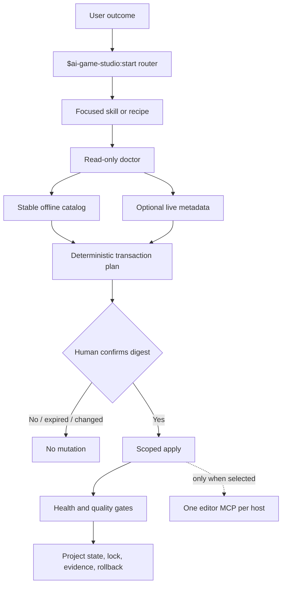

# Architecture

## Design goals

Codex AI Game Studio is deliberately a **skill-first plugin plus optional local packs**, not a mega-MCP that launches every catalog entry. The core must work offline, remain useful without an editor bridge, and never turn discovery into execution.



## Packages

| Package | Trust level | Responsibility |
|---|---|---|
| `ai-game-studio` | Universal core | 85 skills, catalog, recipes, read-only doctor, plan/validation CLI |
| `ai-game-studio-automation` | Optional local | Hooks, project-role materialization, scoped `AGENTS.md`, migration |
| Engine/DCC/pixel packs | Optional local | Inert adapter, one pinned upstream MCP, conflict checks, plan/apply/rollback |
| `ai-game-studio-img2threejs` | Optional Apache-2.0 | Pinned reference-to-procedural-Three.js forge and quality gates |
| Windows/macOS editions | Optional local | Native host routing, deterministic adaptation rules, edition transactions |
| External catalog entries | Never bundled | Models, weights, libraries, applications, benchmarks, and tools selected per workflow |

Each plugin owns a valid `.codex-plugin/plugin.json`; the repository marketplace at `.agents/plugins/marketplace.json` controls ordering and availability. Core skills are discoverable through `/` and explicitly invoked as `$ai-game-studio:<skill>`.

## Runtime layers

### Skill layer

Skills classify intent, preserve creative context, choose recipes, request material decisions, and interpret validation evidence. `start` is the main router; `help` recommends the next workflow based on project state. Long prompt patterns and domain references stay outside frontmatter.

### Deterministic layer

The standard-library Python CLI owns facts that should not vary with model reasoning:

```text
doctor
catalog search|recommend|refresh
pack doctor|plan|apply|disable|rollback
edition doctor|plan|apply|disable|rollback
migrate claude
validate plugin|skills|catalog|parity|platform
```

PowerShell and POSIX wrappers locate an appropriate Python 3 executable and delegate to the same implementation. No Git Bash is required on Windows.

### Data layer

- `catalog/catalog.json`: stable, human-reviewed curation.
- `catalog/snapshots/*.json`: volatile GitHub stars/releases/activity/archive snapshots.
- `recipes/*.json`: ordered production stages, artifacts, capabilities, fallbacks, provenance, rollback, and gates.
- `packs/*.json`: host, platforms, source pin, tokenized command/arguments, conflicts, permissions, health checks, uninstall, and rollback.
- `editions/*.json`: target OS/architecture, native shells and GPU routes,
  applications, incompatible-tool adaptations, limitations, permissions,
  health checks, uninstall, and rollback.
- `.ai-game-studio/project.json`: selected project policy and workflow choices.
- `.ai-game-studio/lock.json`: exact external dependency pins and transaction state.

## Transaction protocol

A mutating operation cannot construct and apply actions in one step.

1. `plan` detects the environment again and canonicalizes a transaction.
2. The transaction includes an ID, timestamps/expiry, exact actions, downloads, licenses, permissions, backups, rollback operations, and detected environment.
3. A SHA-256 digest is computed over canonical JSON excluding the digest field.
4. The user reviews the rendered proposal and confirms that digest.
5. `apply` reloads the plan, verifies the digest/expiry/environment assumptions, then performs only listed operations.
6. Health checks and quality gates run. Failure triggers a bounded rollback offer; it never broadens the plan.

Backups live under the active project or plugin data root, not a broad home/workspace target. Resolved paths are checked before copy, removal, or restoration.

Edition selection itself installs nothing. It records the Windows or macOS
route in the same project and lock documents after digest confirmation.
Package-manager actions, Rosetta, WSL, editors, MCPs, models, and hosted
services remain separate proposals.

Each platform plugin ships a native launcher plus a small Python resolver. The
resolver accepts tokenized arguments, never invokes a shell, and locates the
exact matching patch of the core either beside an extracted edition or in the
same Codex marketplace cache. For independent Codex plugin caches, the launcher
hands the core its own canonical, read-only descriptor path. The core accepts it
only after validating the containing plugin manifest, exact version, platform
identity, activation scope, and confirmation-gated rules. It never copies the
descriptor. A missing or version-mismatched core fails closed instead of falling
through to an unrelated command on `PATH`.

## Platform adaptation boundary

The edition plugins never translate an unsupported binary by assertion.
Adaptation follows one ordered decision:

1. Build or port licensed portable source to a native entrypoint and run its
   artifact and quality tests.
2. Compare a verified native capability equivalent by output contract, quality,
   performance, cost, privacy, license, and limitations.
3. Offer a hosted or manual interchange route only after disclosing the data
   boundary and requiring confirmation.

Windows uses native PowerShell or standard-library Python with
CUDA/DirectML/CPU routes; WSL is a disclosed command-line fallback. macOS uses
zsh/POSIX or standard-library Python with Metal/MPS/Core ML/CPU routes; Rosetta
is a disclosed fallback for verified Intel macOS applications. Neither fallback
is treated as native compatibility.

## img2threejs boundary

`ai-game-studio-img2threejs` is pinned to upstream `v1.4.3` at commit
`9a8ecf129a58c1b557a1f03f7727f6295672cd51`. The plugin vendors only the
runtime forge and required reference material, retains Apache-2.0 licensing,
and adds Codex metadata. It does not include model weights or a hosted service.
The workflow may stop at suitability, strict spec, geometry, material,
multi-angle, structure, or bounded-correction gates rather than overclaim
fidelity from inadequate evidence.

Bundled search indexes write to the user's operating-system cache, never into
the installed plugin. Common image inputs use fixed native Windows or macOS
conversion paths; a third-party ImageMagick binary is accepted only through a
confirmed manifest containing its absolute path, SHA-256, version, reviewed
license, HTTPS source, and plan digest. Optional Source2Viewer extraction uses
the same provenance boundary and a fixed timeout.

Optional CS2 metadata and preview downloads are bounded, HTTPS-only, restricted
to exact public hosts, revalidated across redirects, and preserve existing
files unless the user explicitly requests replacement. Localhost, private and
reserved addresses, credentials in URLs, nonstandard ports, unsafe filenames,
and oversized responses are rejected.

## Catalog routing

Live metadata is optional and never overrides stable curation. When online freshness is requested, routing is GitHub connector → authenticated `gh` → public GitHub API → offline snapshot. The weekly Action updates the volatile snapshot on a review branch and opens a pull request.

Recommendation filters are hard constraints first: license/commercial status, OS/architecture, host application, GPU/VRAM, authentication/privacy, permissions, download size, and maturity. Quality/cost/performance comparisons happen only among compatible candidates.

## MCP boundary

Pack `.mcp.json` entries call a bundled inert adapter. On first use it reports that setup is unconfirmed and points to `doctor`/`plan`; it does not fetch or launch upstream code. After a confirmed apply, the adapter resolves the exact lockfile pin and starts the approved local server. Conflicting servers for the same host block activation.

Local servers should use stdio or localhost. Remote exposure, non-loopback binding, broad filesystem access, secret forwarding, and editor writes require explicit disclosure and confirmation.

## Hook boundary

The automation plugin's `hooks/hooks.json` maps 12 upstream behaviors onto supported Codex events. Commands receive official JSON on stdin and use `PLUGIN_ROOT` plus `PLUGIN_DATA`; `commandWindows` avoids POSIX assumptions. Logs are bounded, structured, and redacted. Plugin hooks do not run until the user reviews and trusts them with `/hooks`.

## Quality evidence

Recipes produce artifacts before claims: format validator reports, contact sheets/turntables, temporal overlays, profiler captures, smoke-test logs, screenshot diffs, provenance manifests, and human approval records. Enhancement is candidate-based; source replacement is a separate approved action.
